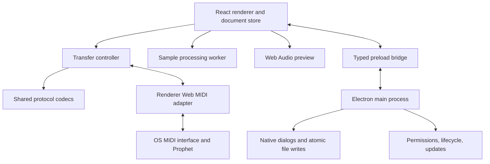

Electron desktop client migration plan
=====================================

Prepared 2026-09-10. This plan adapts the [React and Web MIDI migration plan](React-WebMIDI-Migration-Plan.md) for installable macOS, Linux, and Windows applications. It is a proposed implementation, not a tested Electron port. The existing C++ application and instrument protocol remain the reference; no hardware or packaged-client tests have been performed for this document.

Build a React/TypeScript editor inside Electron, sharing the instrument model, protocol codecs, file formats, and transfer controller with the proposed web application. Start with Electron's bundled Chromium Web MIDI implementation. Prove parameter and sample transfers in packaged applications on all three operating systems before committing to full feature parity. Add a native MIDI adapter only if measured failures justify it.

**Scope and relationship to the web plan**

The web plan's repository analysis, packet formats, reserved-byte preservation, memory constraints, and hardware acceptance requirements apply here. Electron changes deployment and operating-system integration; it does not change the Prophet's MIDI protocol or remove its timing and firmware quirks.

| Concern | Browser application | Electron client |
| --- | --- | --- |
| Runtime | User-selected browser and its Web MIDI support | Pinned Electron/Chromium runtime shipped with each application |
| Platform reach | Hardware access depends on browser support | Dedicated macOS, Linux, and Windows packages; each still requires working MIDI drivers/interfaces |
| MIDI | Web MIDI with browser permissions | Web MIDI with application-controlled Electron session permissions; optional native transport behind the same interface |
| Files | File selection, downloads, browser storage | Native Open/Save/Save As, recent files, file associations, and local recovery snapshots |
| Offline operation | Requires loading/caching application assets | UI, codecs, help, and audio assets bundled for offline use |
| Lifecycle | Browser tab suspension/navigation | Explicit minimize, close, quit, sleep, crash, and update handling |
| Distribution | HTTPS deployment | Installers, signing, notarization, platform testing, and maintained release artifacts |
| Maintenance | Site plus browser compatibility | Site-independent client releases plus Electron/Chromium security updates |

Retain the full target feature set: 16 sounds, 12 presets, 16 map records, standard/expanded memory, parameter editing and copy operations, graphical mappings and envelopes, sample/loop editing, WAV import/export, complete instrument transfers, and legacy library files. Deliver stereo pairing, SoundFont import, waveform generation, and coalesced live updates after core transfers are reliable. The custom serial burst interface is a separate later capability.

**Architecture and code reuse**

Use React and TypeScript for the renderer, Electron for the desktop shell, and Electron Forge for packaging. Vite can build the renderer/main/preload entries, but Forge currently marks its Vite plugin experimental: pin compatible versions and verify clean production builds before adopting upgrades. See [Electron Forge's Vite documentation](https://www.electronforge.io/config/plugins/vite).

If Electron is implemented first, use the shared structure below from the start. If the web application already exists, extract its pure modules without changing their behavior, and retain the same fixture suite. This is shared implementation work, not a second independent protocol rewrite.

```text
apps/
  desktop/
    main/                 windows, files, lifecycle, permissions, releases
    preload/              narrow typed desktop bridge
    renderer/             React composition and Web MIDI service
    resources/            icons, bundled manual, attribution
    forge.config.ts
  web/                    optional browser application shell
packages/
  core/                   instrument model, codecs, memory layout, transfers
  editor/                 reusable React features and controls
  audio/                  conversion, waveform workers, preview
  transport-webmidi/      complete MIDI messages and port lifecycle
  fixtures/               legacy files and captured instrument exchanges
Docs/
  React-WebMIDI-Migration-Plan.md
  Electron-Client-Migration-Plan.md
```



The main process owns windows, native menus, file selection/writes, saved settings, update handling, and shutdown coordination. The sandboxed renderer owns React, the editable document, the transfer controller, Web MIDI, and Web Audio. Run expensive resampling and waveform calculations in workers so they cannot delay MIDI processing. Web MIDI is a renderer browser API; do not assume it is available in Electron's Node main process.

Keep transport, document, and persistence boundaries explicit. A successful send means bytes were queued, not that the instrument accepted them. Track the editable document, last verified device snapshot, and active transfer independently. Renderer reload/crash invalidates synchronization and terminates the job; recovery reopens local data and requires reconnect/readback rather than replaying writes automatically.

If a native transport becomes necessary, host it behind validated IPC in a dedicated utility process so a driver/addon fault does not take down the UI or main process. Keep the transfer state machine next to that transport to avoid per-packet IPC timing dependence. The controller must have exactly one owner in either configuration. Native addons introduce architecture and Electron ABI rebuild requirements, described in [Electron's native module guide](https://www.electronjs.org/docs/latest/tutorial/using-native-node-modules); require maintained dependencies and tested packages before selecting one.

**MIDI access and transfer reliability**

Provide separate input/output selectors, a channel selector, connection state, and a read-parameters action. Connect the USB MIDI interface in both directions. A port name is not proof of the attached sampler model. Record the selected model, ROM revision, memory expansion, and interface for diagnostics. Do not transmit to every enumerated output or depend on an unverified universal identity response.

Call `navigator.requestMIDIAccess({ sysex: true })` from the connection flow and check `sysexEnabled`. Configure both `setPermissionCheckHandler` and `setPermissionRequestHandler` on the application's session before loading the window. Allow only the required `midi`/`midiSysex` permissions for the known application origin and trusted main frame, tied to the user's connection choice; reject other origins and unexpected requests. Implement denial and reset behavior explicitly. Electron documents these permissions and both handler types in its [session API](https://www.electronjs.org/docs/latest/api/session).

Serve packaged UI assets through a registered standard, secure application scheme such as `app://prophet`, with paths constrained to bundled resources. Register the scheme before readiness and install its handler on the same session used by the window. Verify the secure context and MIDI access in the packaged app, not just the development server. See [Electron's protocol API](https://www.electronjs.org/docs/latest/api/protocol).

Port the wire behavior documented in the companion plan: Sequential parameter requests/writes, unusual two-byte parameter packing, 12-bit sample words, 127-byte sample packets containing 60 words, XOR checksums, and counters wrapping at 128. Preserve unknown record bytes. Test all 256 parameter values and 4,096 sample values against independent fixtures. Send each SysEx packet as a complete message.

Use a serialized transaction queue with deadlines, expected-response matching, duplicate detection, bounded retries, WAIT/NACK/CANCEL handling, and explicit failure states. Test short final packets, corrupted frames, unrelated MIDI, and reconnects. The legacy code repairs some malformed messages and disables some NACK handling; retain only narrowly tested repairs. Validate the legacy note-based panic/abort behavior before replacing it. Neither Electron nor a native MIDI library makes these device behaviors disappear.

Keep transfer logic outside React render/effect cycles, coalesce progress updates, and prevent live parameter edits from interleaving with a dump. A complete bank must not be queued far in advance; cancel should stop unsent work and clear scheduled output where supported. Only report successful backups after validating sample lengths and content.

The companion plan's calculated lower bounds remain approximately 178 seconds for 256K words and 355 seconds for 512K words over standard MIDI, before handshakes and retries. Electron does not increase the MIDI cable's throughput. Show observed throughput and ETA rather than treating the desktop client as a faster transport.

During a transfer, configure the transfer-owning renderer to avoid background timer throttling and test minimized/occluded windows on every target OS. Use `powerSaveBlocker` with `prevent-app-suspension` for the job lifetime, releasing it on success, error, cancel, and window failure. This can prevent idle suspension, not guarantee operation through forced sleep or lid closure. Handle suspend/resume by ending or explicitly recovering the transaction. See [Electron's powerSaveBlocker API](https://www.electronjs.org/docs/latest/api/power-save-blocker).

Coordinate close/quit with the active job: offer to wait or cancel, finish cancellation before shutdown where possible, and preserve a local recovery snapshot. Updates must never restart the application during transfers or while unsaved edits remain. Use a single application instance and initially one instrument-owning window to prevent competing controllers.

**Desktop files, audio, and interaction**

Implement native Open, Save, Save As, recent-file history, keyboard shortcuts, and opening files from the OS. Handle macOS open-file events and Windows/Linux launch arguments through one queue that waits until the editor is ready. Opening an association must load a local document, not automatically send it to hardware. Keep Cancel distinct from failure and support Unicode filenames, spaces, read-only destinations, and missing recent files.

Use the same `.p2k`, `.p2s`, `.p2m`, and `.p2p` codecs as the web plan. Validate file signatures/lengths before allocation, preserve reserved/configuration bytes, and separate parsing from memory relocation. Verify native-write byte order against legacy fixtures; do not promise every historical Mac file variant without evidence. A `P2K01` bank contains the parameter blocks, 16 length-prefixed samples, fixed-length names, and configuration data described in the original plan.

Read selected files through the main process as bounded bytes, parse in the sandboxed renderer/worker, and write validated document bytes through the bridge. Use temporary sibling files and tested replace/rename handling for saves, keeping the previous file recoverable on failure. Store versioned recovery snapshots and settings in the application user-data directory, separate from the installed application. Recovery snapshots must not overwrite the user's library files. Back up settings before schema migration and detect unsupported newer formats.

The bridge should expose application operations such as `openDocument`, `saveDocument`, `listRecentDocuments`, and `reportTransferState`, not arbitrary filesystem or IPC access. Validate callers, document handles, payload sizes, and options. Pin saves to paths selected through the application's dialogs. These desktop services should have browser equivalents so editor components remain reusable.

Use Web Audio for sample audition with explicit conversion from 12-bit instrument values. Preserve the 15,625/31,250/41,667 Hz sample-rate choices, WAV loop metadata, stereo bank pairing, and sustain/release/bidirectional semantics. Continue deterministic resampling in a worker or a narrowly scoped WASM module if quality parity requires it. WAV decoding for instrument data must preserve source rate independently of audio-context resampling. Preview is not emulation of the analog filter circuitry.

Provide Connection, Library, Sounds, Maps, Presets, and Transfer views, accessible parameter controls, waveform/loop editing, undo/redo, and dirty-state indicators. Add platform-appropriate menus and shortcuts. Bundle the manual and images when the manual conversion is merged; retain attribution, license information, source links, and the Sequential Samplers support link. The client should edit, preview, and communicate with hardware without network access.

**Application isolation**

Use `contextIsolation: true`, `sandbox: true`, `nodeIntegration: false`, and a restrictive Content Security Policy. Keep renderer code and assets local. Expose a narrow `contextBridge` API, validate IPC senders and arguments, and block unexpected navigation/new windows. Open allowlisted HTTPS help/support links in the system browser, never as privileged application pages. These choices follow [Electron's security guidance](https://www.electronjs.org/docs/latest/tutorial/security).

Treat sample names, imported files, and MIDI data as untrusted input. Render text without HTML interpretation, enforce decoder and memory bounds, and avoid synchronous parsing or filesystem work that can stall critical processes. Keep signing credentials out of application bundles and pull-request jobs. Schedule supported Electron upgrades and repeat transfer regression tests after each runtime change.

**macOS, Linux, and Windows release targets**

Use native CI runners for each OS. Build and test packaged artifacts rather than assuming the development app represents what users install. Choose supported minimum OS versions from the Electron release pinned during phase 0 and publish that exact matrix; do not carry forward the C++ application's historical OS support promise.

| Platform | Initial architectures and artifacts | Required platform checks |
| --- | --- | --- |
| macOS | Separate arm64 and x64 builds; DMG for installation and ZIP where needed for updates | Apple Silicon and Intel hardware; Developer ID signing, hardened runtime/required entitlements, notarization and stapling; test a downloaded quarantined artifact, Finder Open With, menu behavior, sleep/resume, MIDI reconnect, audio output changes |
| Windows | x64 Squirrel installer initially; arm64 after interface/driver validation | Sign executable and installer; verify install/update/uninstall, file associations, second-instance launch, high-DPI display, Unicode paths, ports busy in another MIDI application, and driver reconnect |
| Linux | x64 DEB and RPM initially; additional architectures/formats after validation | Test supported Ubuntu/Debian and Fedora environments, actual package dependencies, MIDI device access, desktop integration, X11/Wayland, and audio stack behavior; run as a normal user with Chromium sandbox enabled |

The installer should not install arbitrary interface drivers or require users to disable OS protections. Document supported interfaces and legitimate driver/access requirements observed in testing. Linux packaging must account for host libraries and MIDI access; a successful build alone does not establish Linux compatibility. Defer Flatpak/Snap and app stores until their sandbox and device access have been tested.

Electron Forge supports the packaging/distribution workflow described in [Electron's distribution overview](https://www.electronjs.org/docs/latest/tutorial/distribution-overview). Arrange macOS and Windows signing identities early and validate them with a minimal packaged app. Follow [Electron's code-signing guidance](https://www.electronjs.org/docs/latest/tutorial/code-signing); signing does not guarantee immediate Windows reputation or eliminate every download warning.

Start the beta with manual updates from versioned release artifacts and published checksums. Add a trusted HTTPS update feed for signed macOS/Windows builds once installation and recovery work reliably. Electron's built-in updater does not support Linux; use package-manager/manual updates there initially. Keep update downloads optional, retain a manual recovery route, and only apply updates after jobs end and edits are saved. See [Electron's autoUpdater documentation](https://www.electronjs.org/docs/latest/api/auto-updater).

PR CI runs type checking, lint, core/transport tests, and unsigned packaging smoke tests without release secrets. Protected release jobs produce signed artifacts, checksums, version metadata, and corresponding source/build instructions. Test upgrade from the previous release, failed/interrupted updates, settings migration, and clean uninstall that leaves user documents intact. Resolve the proposed license through the existing owner review and carry required notices into each distribution.

**Delivery sequence and acceptance gates**

| Phase | Deliverable | Exit criteria | Estimated effort |
| --- | --- | --- | --- |
| 0 — Desktop feasibility | Minimal Electron/React app, packaged on all three OSes; selected ports; parameter read and short sample send/readback; initial signing proof | Matching parameter/sample data on identified hardware, including Apple Silicon; minimized-window timing recorded; transport and supported runtime chosen | 2–3 engineer-weeks |
| 1 — Shared core and native library | Pure codecs/models, simulated instrument, file dialogs, legacy formats, settings/recovery, preload contract | Fixture fidelity and malformed-file rejection; save/reopen and recovery work across OSes; no arbitrary filesystem/IPC bridge | 2–3 weeks |
| 2 — Parameter editor | Sound/map/preset controls, keyboard mapping, copy, native menus, explicit synchronization | Edit/send/readback matches intent for every slot; disconnect/denial/busy-device flows tested; edits survive renderer recovery | 2–3 weeks |
| 3 — Samples and bank transfers | WAV conversion, waveform/loops, audition, complete transaction controller, cancel/lifecycle coordination | Full bank receive/send/receive comparison passes; packet/error cases and minimized/sleep/quit behavior tested; no false success after interruption | 3–4 weeks |
| 4 — Parity and distribution | Stereo/SoundFont/advanced loops, remaining selected features, signed installers, update/recovery tests, bundled help | Installable artifacts pass platform and hardware matrix; compatibility notes and reproducible build instructions published | 3–5 weeks |

Planning range: **12–18 engineer-weeks** for one experienced React/TypeScript/Electron developer with MIDI experience and regular access to the required machines and instruments. This replaces the web-only estimate for a desktop-first implementation; it is not an additional 12–18 weeks if shared web modules already exist. Re-estimate after phase 0. Signing setup, unavailable hardware, native-addon fallback, and firmware quirks may extend elapsed time.

An early parameter-editor beta can follow phase 2. Do not label it a full librarian replacement until phase 3 passes bank backup/restore checks. Wave generation parity is separately scoped within phase 4; custom burst hardware remains outside these estimates.

**Validation and remaining inputs**

Carry forward the web plan's independent packet/file fixtures and simulated-clock tests: ACK/NACK/WAIT/CANCEL, wrong selectors, duplicate/out-of-order data, short final packets, wraparound, timeouts, disconnection, and known corrupt frames. Add desktop tests for origin/permission rejection, invalid IPC, oversized files, failed saves, renderer crash, quit during transfer, and recovery after updates. Verify all local operations with networking disabled.

Hardware tests must record model (2000/2002), ROM, memory expansion, MIDI interface/driver, OS/architecture, and exact Electron version. Require both instrument models before claiming both, at least two MIDI interfaces, standard and expanded memory, empty/full banks, all supported sample rates, and stereo pairs. Test repeated sample-word and parameter equality after complete transfers, including problematic disks where available. Back up instrument data before write tests.

Before phase 0, obtain representative legacy files, a readable SysEx specification, access to macOS/Linux/Windows test machines, and a bidirectional interface. Before release, confirm owner-controlled signing identities, release hosting, supported OS versions, and which late-stage features are mandatory. Simulator success is necessary but cannot replace physical instrument testing.

The first reviewable implementation should be a packaged client on each OS that can connect, read one sound, receive a short sample, and send/read it back accurately. That provides the evidence needed to proceed with the desktop migration.
