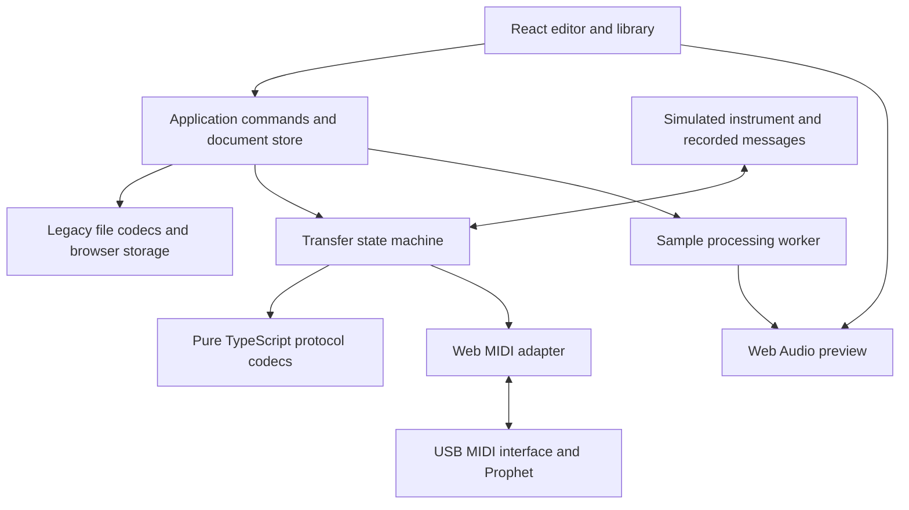

React and Web MIDI migration plan
=================================

Prepared 2026-09-10 from source revision `b2163f1`, with the subsequent license and support-link changes present locally. This is a source-based implementation plan; no instrument communication or native application build was performed. The Word manual was inspected through extracted text, without its screenshots or full layout.

Build a client-side React/TypeScript application around a separately tested Prophet 2000/2002 protocol library. Establish reliable standard-MIDI communication on real hardware before investing in full editor parity. Retain the C++ sources as a reference during migration. The repository provides substantial protocol and feature knowledge, but it is not a ready-to-compile web backend.

**What the repository contains**

| Area | Evidence in this repository | Migration consequence |
| --- | --- | --- |
| Desktop application | [main.cpp](../SRCDIR/main.cpp), [GUILayout.cpp](../SRCDIR/GUILayout.cpp), [README](../README.md) | wxWidgets 2.8.12 and wxFormBuilder UI; no build projects/scripts are supplied. Rebuild the interface as React components. |
| Instrument model and transfers | [proph2000.h](../SRCDIR/proph2000.h), [proph2000.cpp](../SRCDIR/proph2000.cpp) | Approximately 5,763 lines combine memory layout, serialization, packet codecs, transfer state machines, and UI callbacks. Extract the behavior into independent modules. |
| MIDI and serial transport | [midi.h](../SRCDIR/midi.h), [midi.cpp](../SRCDIR/midi.cpp), [thread.cpp](../SRCDIR/thread.cpp), [midithread.cpp](../SRCDIR/midithread.cpp) | RtMidi, PortMidi, and Windows MIDI alternatives; optional custom serial burst hardware. Replace standard MIDI access with Web MIDI and replace polling/sleeps with event-driven transfers. |
| Editing | `soundparam.cpp`, `presetparam.cpp`, `mapparam.cpp`, keyboard/panel/copy-dialog files | Sound synthesis parameters, envelopes, mappings, presets, copy operations, and optional online updates are established features. Build a feature checklist from their handlers and control ranges. |
| Files and library | `Proph2000::load/save`, sound/map/preset load/save handlers | Preserve `.p2k` banks and `.p2s`, `.p2m`, `.p2p` individual files. File comparison and discard behavior also exist. |
| Samples and audio | [loadsample.cpp](../SRCDIR/loadsample.cpp), [wave.cpp](../SRCDIR/wave.cpp), [audio.cpp](../SRCDIR/audio.cpp), `soundfont*.cpp`, `wavedisp.cpp` | WAV/SoundFont import, resampling through libsamplerate, normalization, loop editing, and PortAudio preview. Replace native audio with Web Audio; keep file/sample conversion deterministic. |
| Additional functionality | `wavegen/`, stereo handling, extended-memory configuration | Wave generation and stereo pairing need separate parity work. Review experimental/duplicate sources such as `presetpanel_org.cpp` rather than assuming everything shipped. |
| User documentation | [Prophet2012_Manual.doc](Prophet2012_Manual.doc) | Describes workflows and acknowledges corrupted SysEx and disks that could not be transferred. Hardware compatibility is an explicit release requirement. |

The model has 16 sounds, 12 presets, and 16 map parameter records. Sound, preset, and map records contain 76, 47, and 22 decoded bytes respectively, including bytes not represented by visible controls. The header defines per-bank capacities of 128K sample words for unexpanded memory and 256K for expanded memory. Samples 1–8 and 9–16 belong to separate banks; verify address alignment, padding, and usable capacity from `remapMemory()` and hardware rather than treating the much larger per-sample allocation as a valid instrument limit.

**Browser and hardware boundary**

Use a standard USB MIDI interface connected in both directions: interface OUT to sampler IN, sampler OUT to interface IN. A visible port identifies an interface, not necessarily the connected sampler. Let the user select input and output independently, set the channel, and explicitly read parameters to establish communication; do not depend on universal device identification that this code does not establish.

Request access from a Connect action using `navigator.requestMIDIAccess({ sysex: true })`, verify `sysexEnabled`, and handle unsupported browsers, denied permission, unavailable ports, and disconnection. Serve over HTTPS, with a localhost development server. Hosting policies must allow MIDI, especially if embedded. These requirements follow the [MDN requestMIDIAccess documentation](https://developer.mozilla.org/en-US/docs/Web/API/Navigator/requestMIDIAccess).

Target desktop Chrome and Edge on macOS, Windows, and Linux initially, with Apple Silicon macOS in the primary test matrix. Firefox desktop is a secondary target with its permission-specific onboarding. Safari and Safari on iOS currently lack this API; retain offline file editing there and explain hardware support through feature detection. Do not promise mobile hardware support initially. This target choice follows [MDN's current compatibility data](https://raw.githubusercontent.com/mdn/browser-compat-data/main/api/Navigator.json), checked on the plan date; browser support still requires interface and instrument testing.

Web MIDI sends complete MIDI messages, including each complete SysEx packet; it does not expose the native byte queue used by the original program. Do not split a SysEx message across `send()` calls or use running status. The browser buffers normal incoming messages until complete and handles real-time messages separately. See the [Web MIDI specification](https://www.w3.org/TR/webmidi/).

The custom burst interface changes serial baud rate (`sendBaudRate`, `MIDI::alwaysBurst`, `cfgdlg.cpp`). Web MIDI cannot configure that serial transport. Exclude burst controls and baud-change commands from the standard-MIDI implementation. A later Web Serial or native bridge investigation would be a distinct project with its own hardware/browser validation.

**Architecture**

Use React, TypeScript, and Vite for a static application. This app's instrument and file operations are local, so it needs no server rendering, account system, or application backend. React documents the [Vite React/TypeScript starting point](https://react.dev/learn/build-a-react-app-from-scratch). Select and pin supported tool versions when implementation begins.



Suggested implementation layout:

```text
web/
  src/
    app/                 composition, navigation, settings
    domain/              bank, sound, map, preset, memory allocation
    protocol/            Sequential packets, sample dump codecs, validation
    transfers/           transaction queue, deadlines, recovery, progress
    midi/                browser adapter and simulated transport
    files/               p2k, p2s, p2m, p2p, wav; later sf2
    audio/               sample conversion, preview, processing worker
    storage/             IndexedDB documents and settings
    features/            connection, library, sounds, maps, presets, transfers
    components/          waveform, envelope, keyboard, parameter controls
  tests/fixtures/        byte fixtures, files, captured transfer sessions
```

Keep codecs pure and independent of React, DOM objects, storage, and wall-clock time. Supply a transport and clock to the transfer controller so simulations can drive the same state transitions as hardware. Start with MIDI handling in a small main-thread service outside React rendering; use a worker for resampling and waveform calculations. Worker exposure in specifications is not a reason to depend on worker MIDI support before verifying target browsers.

Maintain three distinct states: editable local document, last successfully read/verified device snapshot, and current transfer job. A successful `send()` only queues bytes; it is not proof that hardware accepted an edit. Show pending/unverified changes, and read back parameters where possible. A disconnection invalidates device synchronization without discarding local edits. Keep sample buffers outside frequently copied React state and expose immutable metadata/revision snapshots.

**Protocol work that must precede broad UI development**

Document the actual wire format from the C++ and verify it with captured messages. Do not substitute a generic sample-dump library without proving exact compatibility.

| Message or behavior | Observed implementation | Required treatment |
| --- | --- | --- |
| Generic parameter request | `F0 01 00 selection F7`; sound selections `00–0F`, presets `40–4B`, maps `60–6F` | Encode exact requests and validate response type/selection. Requests can affect active selections; document and test those side effects. |
| Parameter write | `F0 01 11 selection … F7`; sound writes use `30–3F` | Complete packet lengths are 157 bytes for sounds, 99 for presets, and 49 for maps. Read and write selectors are not identical for sounds. |
| Parameter byte packing | `updateParamBytesFromStruct()` | Each byte `v` becomes `[v & 0x0f, (v >> 1) & 0x78]`; decode with `a | (b << 1)`. Test all 256 values and preserve reserved bytes. |
| Sample transfer | Universal non-realtime `F0 7E …`, with dump header/request/data and ACK/NACK/WAIT/CANCEL | Decode headers, channel/device fields, sample period, lengths, and loops explicitly. Avoid confusing UI channel 1–16 with wire numbering. |
| Sample data packet | `sendDataPacketBlock()` | 127 bytes including framing, containing 60 sample words encoded into 120 payload bytes; 12-bit words use high 7 bits then low 5 bits shifted left by 2. XOR checksum; packet counter wraps at 128. |
| Transfer deadlines | Constants at top of `proph2000.cpp` | Existing values include 2,000 ms receive timeout, 1,000 ms upload retry, 800 ms ACK timeout, and 600 ms download retry. Treat these as starting evidence, not browser guarantees. |
| Recovery | `receiveHandler()` and transfer handlers | Several malformed-header/data repairs exist, and NACK recovery is explicitly disabled/commented as not working in places. Test standard transfers and known quirks independently; do not silently repair arbitrary malformed input. |
| Panic and abort | `sendPanic()` and transfer recovery | The legacy panic sends note-on/off for note 40; another recovery path sends note-off 30. Validate why these work before replacing them with generic controller messages or sending them automatically. |

Implement one active transaction per selected instrument connection. Correlate responses with the expected message, selector, channel where present, and packet number. Filter unrelated traffic. Support bounded retries, duplicate detection, checksum failures, out-of-order packets, WAIT deadlines, cancellation, and clear terminal errors. Audit parameter write handlers to establish which operations have acknowledgments and which require settling time/readback.

Process ACK/WAIT handling promptly, coalesce progress updates, and keep resampling off the MIDI path. Do not queue an entire bank of future sends: cancellation must stop unsent work and clear queued output where supported. Specify restart behavior after disconnection or suspension; do not claim arbitrary mid-sample resume. Test backgrounding and sleep, and mark interrupted jobs unsuccessful if deadlines expire.

Transfer speed remains a physical limit. Using the legacy standard-MIDI rate of 31,250 bits/s and 10 serial bits per byte, a 127-byte packet needs about 40.6 ms on the wire. At 60 sample words per packet, 256K words take roughly 178 seconds and 512K words roughly 355 seconds for data alone, before headers, handshakes, and retries. These are calculated lower bounds, not measured browser performance. Show measured throughput and a realistic ETA.

**Files, sample processing, and editor behavior**

Preserve `.p2k` compatibility before adding a new project format. `save()` writes `P2K01`, packed sound/preset/map records, 16 length-prefixed sample buffers, 16 fixed 255-byte names, and a 34-byte configuration block. Native integer writes make byte order a compatibility concern: begin with explicit little-endian parsing for verified Windows/Intel files, and obtain older Mac fixtures before claiming their compatibility. Validate magic, remaining bytes, lengths, sample ranges, and total bank capacity before allocating or modifying a document. The old loader reads the magic without validating it and trusts lengths; those behaviors should not be carried over.

Preserve reserved parameter/configuration bytes and original name bytes where possible. Determine name encoding from fixtures. Make parse/serialize lossless for supported files; apply memory relocation as a separate intentional transformation because legacy loading calls `remapMemory()`. Add `.p2s` sound/sample, `.p2m` map, and `.p2p` preset codecs using their existing handlers.

Keep instrument samples as 12-bit values in typed buffers, with explicit conversion to floating-point preview audio. Support the three sample rates used by the code: 15,625, 31,250, and 41,667 Hz. WAV import must preserve source rate and loop metadata before conversion, rescale loop positions, handle mono/stereo selection, and check memory limits. `decodeAudioData()` resamples to the audio context's rate, so use an explicit WAV parser/conversion path for instrument data and reserve browser decoding for suitable preview operations. See [MDN decodeAudioData](https://developer.mozilla.org/en-US/docs/Web/API/BaseAudioContext/decodeAudioData).

Compare normalization, silence handling, clipping, padding, and zero-crossing behavior with legacy fixtures. The existing resampler uses libsamplerate's sinc mode; evaluate a maintained resampler or a narrowly scoped WASM build if quality parity requires it. Do not compile the entire wxWidgets application to WASM. Retain sustain/release and bidirectional loop semantics; simple looping preview can use Web Audio buffers, with an AudioWorklet considered for exact advanced loop playback. Browser sample audition should not be presented as emulation of the sampler's analog filters.

Build the interface around Connection, Library, Sounds, Maps, Presets, and Transfer status. Use a canvas waveform with accessible numeric loop/start/end controls; use reusable parameter and envelope controls rather than reproducing every generated desktop widget. Make manual Send the initial behavior. Add optional live editing later with coalescing and a bounded queue, suspended during dumps. Changing a local control or rerendering a React component must never implicitly start a destructive transfer.

Include undo/redo for document edits, dirty-state indication, autosaved local drafts, and explicit downloads for durable backups. Use browser file selection/downloads as the baseline and IndexedDB for the local library; storage persistence is not a substitute for exported files. Keep source, attribution, license, and the Sequential Samplers support link accessible in the application. Carry the proposed AGPL licensing into the web work subject to the owner's review of the existing license PR.

**Delivery sequence and acceptance gates**

| Phase | Work and deliverable | Exit criteria | Indicative effort |
| --- | --- | --- | --- |
| 0 — Characterize and prove communication | Feature checklist; protocol notes; legacy file fixtures; small React connection/trace screen; selected parameter read; short sample receive and controlled send/readback on a backed-up instrument | Repeated valid parameter reads and a verified short sample round trip on an identified model/ROM/interface; record timing and recovery observations. If this fails, investigate transport before expanding UI. | 1–2 engineer-weeks |
| 1 — Foundation and offline library | Vite/TypeScript app; pure model/codecs; `.p2k/.p2s/.p2m/.p2p` import/export; memory accounting; simulated device; local persistence | Fixture round trips preserve supported data and reserved bytes; malformed/oversize files are rejected without changing the open document; offline save/reopen works. | 2–3 weeks |
| 2 — Parameter editor | Sound, preset, map controls; keyboard maps; envelopes; copy operations; parameter read/write; explicit synchronization status | Edit/send/readback matches selected values; unrelated records remain intact; all 16 sound/map and 12 preset slots covered; disconnect and permission-denial flows work. | 2–3 weeks |
| 3 — Samples and full transfers | WAV import/export; resampling; waveform/loop editing; preview; complete sample transfer controller; bank upload/download; progress/cancel | Checksum and sample-word equality after transfers; full standard and expanded-memory cases; packet wrap/final packet tests; cancellation and retry exhaustion terminate predictably. | 3–4 weeks |
| 4 — Parity and release | Stereo pairing, SoundFont import, advanced loops, remaining copy/live-edit features; waveform generator if confirmed in release scope; cross-platform hardware tests; deployment/docs | Publish a feature/compatibility matrix, documented limitations, repeatable build, and verified release backup/restore workflow on each supported hardware profile. | 2–4 weeks |

Planning range: **10–16 engineer-weeks**, assuming one experienced React/TypeScript developer with MIDI protocol experience and regular hardware access. This is an estimate, not a commitment; re-estimate after phase 0. Hardware availability, legacy files, and difficult firmware quirks can extend elapsed time. An early parameter-editor release can follow phase 2, but full sample/bank migration requires phase 3. Burst hardware remains a separate later scope.

Implement the phases as small reviewable PRs, beginning with protocol characterization and the connection proof. Keep the existing license/support PR focused on its current scope; this planning task does not publish code or alter that PR.

**Validation strategy**

Use unit tests for packet encoding/decoding, byte order, memory mapping, reserved bytes, sample conversion, and loop boundaries. Include malformed inputs and independently captured expected bytes, rather than relying solely on encoder/decoder round trips that could share a bug. Exhaustively test the 256 parameter values and 4,096 sample values.

Use a simulated instrument and fake clock for successful jobs, delays, NACK, WAIT, missing ACK, duplicate packets, counter wrap, wrong selectors, short final packets, corrupted checksums, unrelated MIDI, cancellation, and disconnect/reconnect. Legacy corruption repairs should each have a fixture and a documented hardware applicability condition. Unexpected or unrepairable data must remain an error, never a successful backup.

Use browser integration tests for permission denial, absent API, port changes, import/export, edit/undo, transfer locks, progress, and persistence. Keep protocol tests independent of browser MIDI availability; browser mocks do not establish hardware correctness. CI should run type checking, lint, codec/controller tests, UI tests, and a production build.

For hardware acceptance, record model (2000/2002), ROM revision, memory expansion, MIDI interface/driver, OS, and browser. Exercise at least two MIDI interfaces, both models before claiming both, standard and expanded memory, empty/full banks, all sample rates, mono/stereo pairs, and known problematic disks where available. Require repeated complete receive/send/receive comparisons, compare parameter and sample content, and test timeout/disconnection/sleep recovery. Use exported backups and explicit destination selection before writes that replace instrument data.

**Inputs needed during phase 0**

- Access to a Prophet 2000 or 2002, its ROM/memory details, and a bidirectional MIDI interface; obtain a second model/profile for broader support claims.
- Representative legacy `.p2k`, `.p2s`, `.p2m`, and `.p2p` files, plus successful and problematic transfers if available. No such fixtures or automated tests were found among tracked files.
- A readable instrument SysEx specification and full review of the included manual's screenshots to resolve ambiguities; code alone is not proof of intended hardware behavior.
- A priority decision on stereo, SoundFont, and waveform generation for the first public release. The default sequence above delivers WAV and reliable bank operations first.
- Owner review of the license proposal before a licensed public web release, and a chosen HTTPS deployment location when release work begins.

The first implementation milestone should demonstrate: connect to selected ports, read one sound's parameters, receive a short sample, and send/read it back with matching values and sample words. That result will establish whether the most uncertain part of this migration works on the intended hardware.
