# Prophet2012 User Manual

**Version 1.4 · 03-23-2018**

Converted from the [original Word manual](../../Docs/Prophet2012_Manual.doc). The original wording, section numbering, and screenshots are retained; navigation and formatting have been adapted for Markdown.

## Contents

- [1 Introduction](#1-introduction)
- [2 Features](#2-features)
- [3 Menu Bar](#3-menu-bar)
- [3.1 File](#31-file)
- [3.1.1 Load](#311-load)
- [3.1.2 Save](#312-save)
- [3.1.3 Discard](#313-discard)
- [3.1.4 About](#314-about)
- [3.2 Transfer](#32-transfer)
- [3.2.1 Transfer to PC](#321-transfer-to-pc)
- [3.2.2 Transfer to Prophet](#322-transfer-to-prophet)
- [3.2.3 Get all parameter](#323-get-all-parameter)
- [3.2.4 Send all parameter](#324-send-all-parameter)
- [3.2.5 Send Panic](#325-send-panic)
- [3.2.6 Online update](#326-online-update)
- [3.3 Options](#33-options)
- [3.3.1 Configure the installed memory of your Prophet](#331-configure-the-installed-memory-of-your-prophet)
- [3.3.2 Intelligent Loop Points](#332-intelligent-loop-points)
- [3.3.3 Apply parameter changes to all](#333-apply-parameter-changes-to-all)
- [3.3.4 Stereo mode](#334-stereo-mode)
- [3.3.5 Config](#335-config)
- [3.3.6 View](#336-view)
- [4 Main Window](#4-main-window)
- [4.1 General](#41-general)
- [4.2 Managing Samples](#42-managing-samples)
- [4.2.1 Loading Samples](#421-loading-samples)
- [4.2.2 Play](#422-play)
- [4.2.3 Delete](#423-delete)
- [4.2.4 Import](#424-import)
- [4.2.5 Export](#425-export)
- [4.2.6 Generate](#426-generate)
- [4.3 Save all](#43-save-all)
- [5 Sounds](#5-sounds)
- [5.1 Loop Editor](#51-loop-editor)
- [5.1.1 Editing loops](#511-editing-loops)
- [5.2 Sample Configuration](#52-sample-configuration)
- [5.2.1 Key mapping of a sound](#521-key-mapping-of-a-sound)
- [5.3 Analogue Settings](#53-analogue-settings)
- [5.4 Play sound](#54-play-sound)
- [5.5 Context Menu](#55-context-menu)
- [5.5.1 Load](#551-load)
- [5.5.2 Save](#552-save)
- [5.5.3 Get Sound](#553-get-sound)
- [5.5.4 Get Sound Parameter](#554-get-sound-parameter)
- [5.5.5 Copy](#555-copy)
- [5.5.6 Copy Parameters to all](#556-copy-parameters-to-all)
- [5.5.7 Delete sample data](#557-delete-sample-data)
- [5.5.8 Import WAV](#558-import-wav)
- [5.5.9 Export WAV](#559-export-wav)
- [5.5.10 Wave Generator](#5510-wave-generator)
- [5.5.11 Purge](#5511-purge)
- [6 Maps](#6-maps)
- [6.1 Context menu](#61-context-menu)
- [6.1.1 Load](#611-load)
- [6.1.2 Save](#612-save)
- [6.1.3 Copy](#613-copy)
- [7 Preset tab](#7-preset-tab)
- [7.1 Context menu](#71-context-menu)
- [7.1.1 Load](#711-load)
- [7.1.2 Save](#712-save)
- [7.1.3 Copy](#713-copy)
- [8 MIDI Keyboard](#8-midi-keyboard)
- [9 Known issues](#9-known-issues)
- [10 Contact](#10-contact)

## 1 Introduction
First of all I have to apologize: I am about 25 years late with this software ;-)

17 years ago I had a Prophet 2000, which I had received from a guy, who was interested in my Kawai K-5. Due to the fact I had no sampler and the K-5 was not the perfect machine for my needs, I just swapped with him. A few months later the first problems occurred: I had to warm it up for about half an hour before using it. Before warming up the control panel did wired things – no reaction on pressing switches or toggling to other columns or rows than selected. Another two years later things are getting more worse. So I gave my Prophet to a friend.

Meanwhile I have quite a lot of old Synthesizers and I remembered the good old Prophet 2000 filters.

So in April 2012 I bought a Prophet 2002 to get these fantastic filters back.

Looking on the Internet for an editor or librarian I could not find anything running on a modern PC. There are just a few programs to handle SDS – but none of them could handle the Prophet specific parameters. After looking into the user manual I found the SysEx specification, and I decided to implement a tool for my demands. Now a couple of weeks later I thought to share my program with all Prophet users.

There might be still some bugs – but there might be still some updates in the future.

As for free software common I have to mention, that you are using this Software at your own risk!

If you are working with this software I still recommend saving your data to disk (if you have got a working disk drive).

## 2 Features
- Dump all samples, presets and parameters from a Prophet 2000/2002 to a PC

- Dump all samples, presets and parameters from a PC to a Prophet 2000/2002

- Save and load dump files on a PC (Build up your Prophet library on your PC and share it with others)

- Import and export samples as WAV files

- Sample rate conversion when importing WAV files to Prophet supported sample rates

- Edit sustain and release loops with preview on the PC speakers

- Save and load of a single sound (incl. sample)

- Save and load of a single map

- Save and load of a single preset

- Configuration of all parameters

- Graphical display and edit of sample maps

- Stereo mode in order to play stereo samples on the Prophet (4 voice polyphony)

- You could still use your Prophet with a broken disk drive (if you already have got some dump files to transfer…)

- It is free!

- Remember to save your data, as autosave or reminders (not to mention rollback) are not implemented

## 3 Menu Bar
The application window contains two sections, the menu bar and a notebook page. This section describes the functions available under the various menu bar items.

### 3.1 File
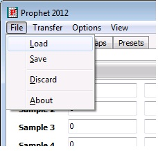

#### 3.1.1 Load
To load a dump file. A dump file consists of all sounds, maps and preset parameters.

#### 3.1.2 Save
To save a dump file. All current sounds, maps and presets will be stored in a dump file.

#### 3.1.3 Discard
This will reset all settings and delete the samples within the Prophet2000Dumper software to start a new project from scratch.

#### 3.1.4 About
This option displays version, author and other relevant information.

### 3.2 Transfer
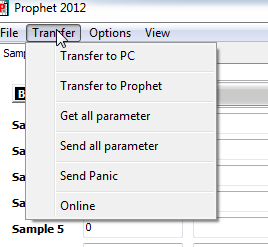

#### 3.2.1 Transfer to PC
To transfer all sounds, maps and presets from the Prophet 2000/2002 to the connected PC.

#### 3.2.2 Transfer to Prophet
To transfer all sounds, maps and presets to the connected Prophet. Everything inside the Prophet will be overwritten – so take care there is not any unsaved data!

#### 3.2.3 Get all parameter
Retrieves all sound, map and preset parameters from the connected Prophet. This could be used after some parameters have been edited by the Prophet panel. No sample data will be transferred to the PC. Take care to have all the data synchronized between the PC and the Prophet (Transfer to PC or a transferred dump file to the Prophet before) before using this button.

#### 3.2.4 Send all parameter
This option will send all sound, map and preset parameters to the connected Prophet.

#### 3.2.5 Send Panic
We recommend you don’t Panic. If you think you need to, select this option. It will send a note-off to the connected instrument in order to kill hanging notes.

#### 3.2.6 Online update
If the ‘Online’ feature in the ‘Transfer’ menu is selected, all changes of any parameter will be transferred immediately to the connected Prophet. This will cause a note being played to be cut off.

### 3.3 Options
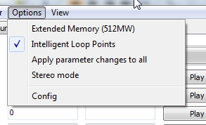

#### 3.3.1 Configure the installed memory of your Prophet
If the connected Prophet has an extended memory (512MW aka 768KB),select the ‘Extended Memory’ entry in the ‘Options’ menu . If your Prophet has only 256MW (384KB) please ensure that ‘Extended Memory’ is not selected. Should you be a lucky owner of a working 1MW upgrade installed, Prophet 2012 will operate on the selected memory page.

#### 3.3.2 Intelligent Loop Points
Will trigger a zero-slope algorithm, useful in the ‘Loop Editor’.

#### 3.3.3 Apply parameter changes to all
A parameter change (e.g. release time) of one sound will also be applied to all the other sounds.

#### 3.3.4 Stereo mode
This mode will turn the Prophet into a 4 voice stereo sampler.

With enabled stereo mode a stereo wav file will be loaded into both banks. The left channel will be in Bank A and the right channel in Bank B. Changes of any sample parameter will also be applied to the other channel sample (e.g. loop parameters, envelope parameters etc.) – independent if left or right channel sample is edited. The previous behavior is also the same for the selected map which is edited. With enabled stereo mode the sample playback within the editor will also be in stereo.

A mixture of mono and stereo samples is not possible within one Preset due to the limitations of the Prophet. The stereo mode is based on the principal that in MIDI mode 3B and layered key mapping samples in Bank A will always played back on the left output, and Bank B samples on the right output.

The state of this option will be saved within a P2K file and will be set accordingly when loading a P2K file.

In the current version SoundFonts could only be imported in mono (stereo mode enabled does not have any influence on the import of SoundFont samples).

Mapping a sample in one map will also map the opposite channel sample into the corresponding map. E.g. placing the left sample into map 1 will automatically map the right sample into map 9.

The following sample mapping will be used with stereo mode enabled:

| Sample # | Virtual sample # |
| --- | --- |
| 1             | Left Stereo sample \#1  |
| 2             | Left Stereo sample \#2  |
| 3             | Left Stereo sample \#3  |
| 4             | Left Stereo sample \#4  |
| 5             | Left Stereo sample \#5  |
| 6             | Left Stereo sample \#6  |
| 7             | Left Stereo sample \#7  |
| 8             | Left Stereo sample \#8  |
| 9             | Right Stereo sample \#1 |
| 10            | Right Stereo sample \#2 |
| 11            | Right Stereo sample \#3 |
| 12            | Right Stereo sample \#4 |
| 13            | Right Stereo sample \#5 |
| 14            | Right Stereo sample \#6 |
| 15            | Right Stereo sample \#7 |
| 16            | Right Stereo sample \#8 |

#### 3.3.5 Config
Application settings that define your setup are accessible through this dialogue.

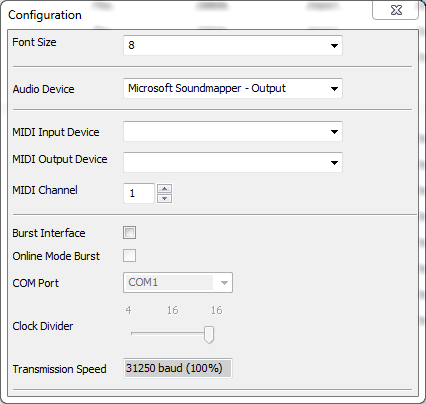

- Font Size: If you run a custom screen configuration, you may encounter corruption of the application interface. Selecting a different font size may remedy this effect. The application needs to be restarted to put the new setting into effect. A warning will be displayed to remind you. Standard Setting: 8pt.

- Audio Device: The device that will be used for playback of samples for monitoring purposes during loop editing or for sample auditing.

- MIDI Input device: Select your MIDI Input Device

- MIDI Output Device: Select your MIDI Output Device

- MIDI Channel: The MIDI Channel Prophet 2012 operates on.

- Burst Interface Options : Support for custom hardware interface that accelerates the data exchange between the application and the instrument. Please check the website for information.

#### 3.3.6 View
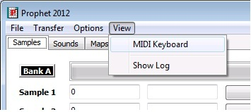

This option will bring up the MIDI Keyboard (see section 8). It will also display the log window which may be useful in case of issues.

## 4 Main Window
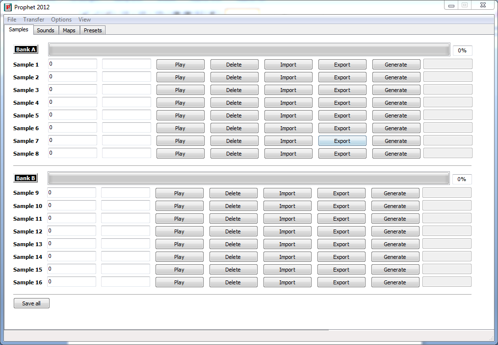

### 4.1 General
The program always starts on the notebook page showing the sample organization. It’s a good idea to have yourself familiarized with the program options (Menu-\>Options) and set the configuration to match your setup (Menu-\>Options-\>Config) before you start managing your samples.

### 4.2 Managing Samples
#### 4.2.1 Loading Samples
You can load your sample slot contents in various ways.

- LOAD a dump file via Menu-\>File-\>Load. The name of the file loaded will be displayed in the title bar of the application.

- Transfer to PC: Menu-\>Transfer-\>Transfer to PC will issue a series of SYSEX DUMP requests to the connected Prophet that will retrieve all samples, settings, maps and presets from the instrument.

- IMPORT: This button will let you import .WAV Files or SoundFont™ Instruments from files. Standard settings will be used, no mapping will be applied. See ‘Import Dialogue’ for details.

- GENERATE: Use the internal wave generator engine to create a synthesized wave. Please read section ‘The Wave Generator’ for operation.

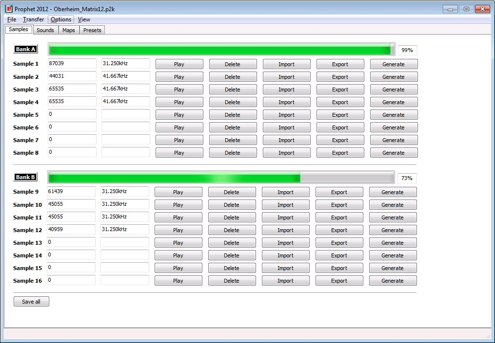

The gauge will show you the amount of memory used by memory bank.

#### 4.2.2 Play
Audit a sample occupying a certain sample slot.

#### 4.2.3 Delete
The DELETE button will erase the sample in the respective slot. Sample settings, parameters and mappings related to the sample slot will be retained.

To clear all samples slots at once, select Menu-\>File-\>Discard.

#### 4.2.4 Import
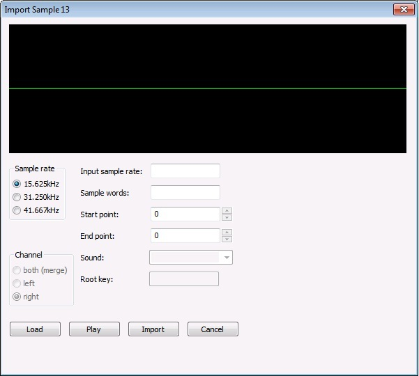

You can import .WAV files or SoundFont™ instruments using the following options:

- Sample rate: This is the Prophet supported sample rate for the imported sample. If the input sample has got a different sample rate, a sample rate conversion will be performed.

- Channel: To select the channel to be imported (if a stereo sample has been loaded). The option ‘both’ will mix both channels to form a mono sample. This option is not available with enabled stereo mode as left and right channel will be handled automatically.

- Input sample rate: The original sample rate of the loaded sample.

- Sample words: The number of sample words which are going to be imported.

- Start Point: Start point for the imported sample. A value could be entered as well, but a press on return is required to carry over the new value. A red line is displaying the start point in the wave view. When changing the value with the spin controls, the next zero crossing position will be used.

- End Point: End point of the imported sample. A value could be entered as well, but a press on return is required to carry over the new value. Another red line is displaying the start point in the wave view. When changing the value with the spin controls, the next zero crossing position will be used.

- Sound: Select an instrument from the loaded SoundFont™ file to be loaded.

- Root Key: Will display the Root Key of the selected instrument in the loaded SoundFont™ file.

Click once inside the wave view and use the mouse wheel to zoom in or out.

Click once inside ‘Start’ or ‘End’ data field and use the mouse wheel to change the value.

Buttons:

- LOAD: Will load a file (.WAV or .SF/.SF2)

- PLAY: The ‘Play’ button will do its purpose ☺

- IMPORT: Will import the sample to the selected sample slot. In stereo mode the left channel will be imported to Bank A and the right channel to Bank B.

- CANCEL: Close the dialogue without importing the sample.

#### 4.2.5 Export
A sample can be exported as .WAV file by clicking on the ‘Export’ button on a sample slot. A file dialog is requesting the filename. The file will be converted from the internal 12-bit to 16-bit resolution, and the original sample rate will used.

Currently only mono samples could be exported.

#### 4.2.6 Generate
Although the term sample is generally used in the context of ‚externally captured audio event’, the Prophet2012 software provides means to generate a ‘sample’ based on various algorithms. The generation of waveforms is not emulating ‘analogue’ circuits. It is based on several purely mathematical models which are applied to the interaction of 4 ‘Oscillators’. The applicable models are

- Ring Modulation, XOR, Additive, FM

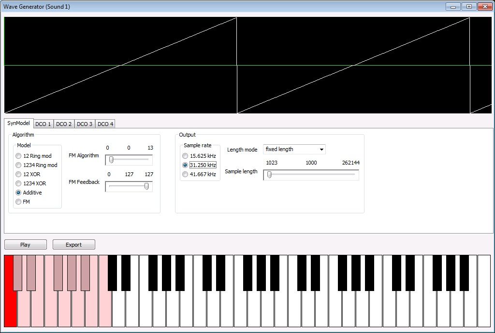

The ‘Oscillators’ are designed to generate complex waveforms using volume and envelope modulation techniques.

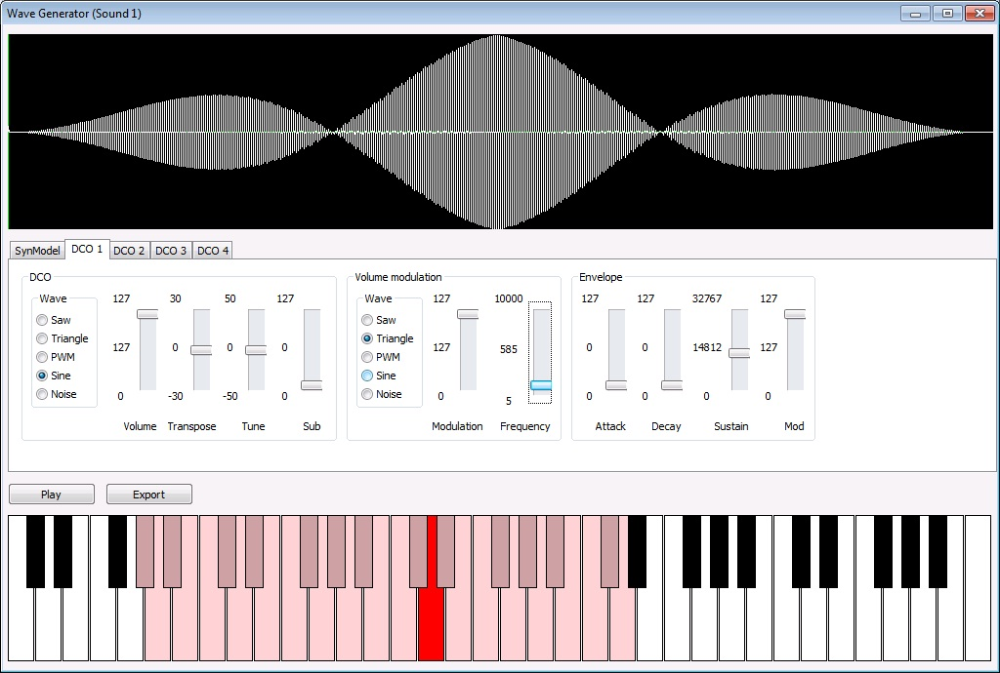

### 4.3 Save all
‘Save all’ will save all samples as separate WAV files. The filename being entered in the file dialog will be used as the beginning of each WAV file. E.g. if you specify the filename ‘Samples’ the sample number will be appended to this filename (Samples_1.wav, Samples_2.wav etc.).

## 5 Sounds
The term ‘Sample’ refers to a waveform that occupies a memory location. A sample has certain additional properties that define the ‘Sound’. The Prophet 2000/2002 architecture adds these properties to a ‘Sample’ to define a ‘Sound’:

- Sample data related information: Playback variations, loop points, loop behavior

- Configuration data: Pitch and Mapping

- Analogue configuration: Envelopes, Filter and Velocity

Each sound (of which the instrument can manage up to 16) has its own tab to manipulate these sample specific settings. The parameters which affect the mentioned settings are accessible via three notebook pages on the Sounds page: ‘Loop edit, ‘Sample config’ and ‘Synth’.

### 5.1 Loop Editor
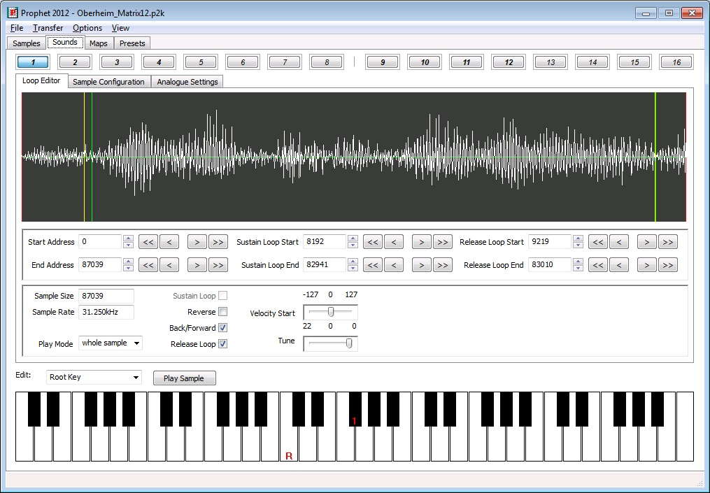

On this notebook page, all loop relevant parameters can be edited. Furthermore the sample start and end point can be manipulated here, statically by fixing the points and dynamically, depending on velocity information.

Click once inside the wave view and use the mouse wheel to zoom in or out. Alternatively, you can use the ‘+’ and ‘-‘ keys.

Click once inside ‘Start’ or ‘End’ data field and use the mouse wheel to change the value. The up/down cursor key can be used as well the change the value.

The buttons with the symbols \<\<,\< \>,\>\> will help you navigate through the sample quickly.

#### 5.1.1 Editing loops
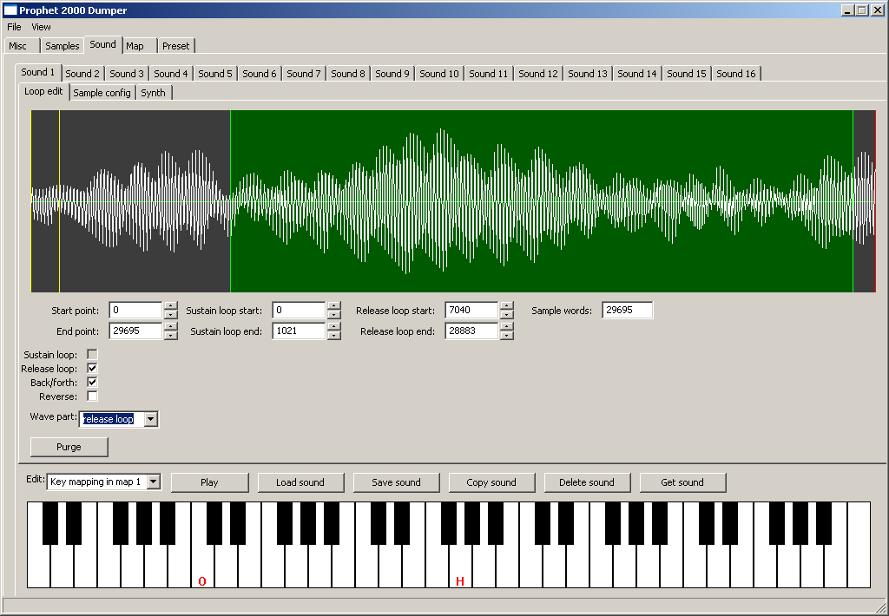

There are different colored lines:

The red lines are indicating the sample start and end point. The yellow lines are indicating the sustain loop start and end points, and the green lines are indicating the release loop start and end points.

To change the ‘Play’ button behavior you must select under ‘Play mode’ one of the options:

- ‘whole sample’ will playback the sample defined by its start and end points once. The grey highlighted area will display the sample part between the start and end points.

- ‘sustain loop’ will playback the sustain loop audible part until you press ‘Play’ again. The yellow highlighted area will display the sample part between the sustain start and sustain end points.

- ‘release loop’ will playback the release loop audible part until you press ‘Play’ again. The green highlighted area will display the sample part between the release start and release end points.

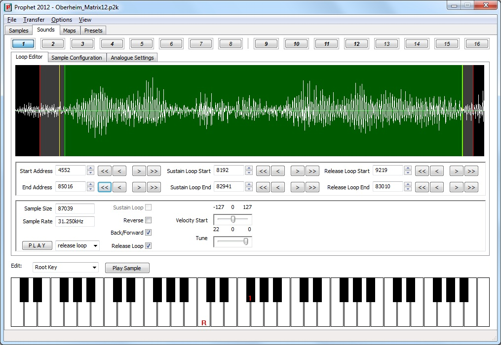

**Remark: The sustain and release start point can not be set before the sample start point. The release start point will always be after the sustain start point. This is a constraint given by the Prophet itself. If you move the release start point before the sustain end point, the sustain end point will be set before the release start point and might destroy the setting for the sustain loop!**

### 5.2 Sample Configuration
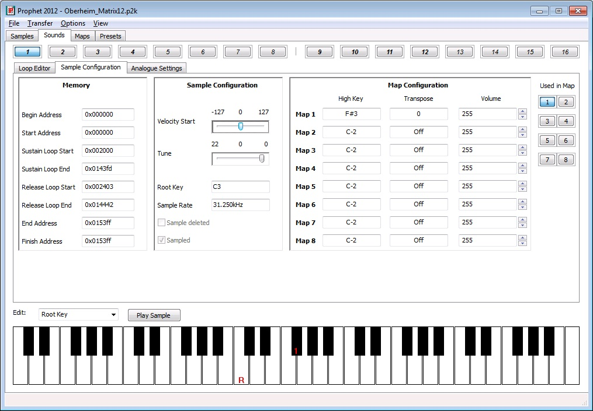

On this notebook page all sound relevant memory addresses will be displayed for information purposes. Normally you do not need to take any notice of them. They are just for your information.

The assigned high keys within all maps will be displayed as well. Normally you do not need this information, due to the fact that all high keys will be displayed on the onscreen display with their corresponding map number (only if the keyboard edit mode is set to ‘Root key’!).

The velocity depended start point can be changed on this tab as well. Tune table is affecting the fine tune of the current sound.

A quick-access feature on the right hand will display the maps using the sample by highlighting the respective map number on the button. Clicking on one of these buttons will display the map page selected.

#### 5.2.1 Key mapping of a sound
Above the keyboard you chose the edit behavior of the onscreen keyboard:

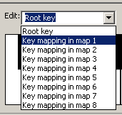

If ‘Root key’ is selected, a left click on the keyboard will set the samples root key. The root key will be displayed with a ‘R’ on the keyboard. Numbers on the Keyboard will tell you the high keys of the selected sample in all the other maps. If no number is displayed, the high key might be beyond the visual range of the Keyboard (init value is C-2).

To map a sample inside one of the 8 maps, you have to select the map to be edited (Key mapping in map X).

**Remember samples 1-8 can only be assigned to the maps 1-8. Samples 9-16 can only be assigned to maps 9-G.**

The mapping of a sample inside a map consists of two parameters:

- High key of the sample

- Original key of the sample

Clicking with the right mouse button on the keyboard will set the high key for the sample in the selected map. The selected high key will be displayed with a ‘H’ on the keyboard.

Left clicking on the keyboard will set the original key for the sample in the selected map. The selected original key will be displayed with a ‘O’ on the keyboard. Clicking again on the same key will remove the assigned original key again.

**Remark: To enable a sample inside a map the original key must be set. To disable a sample in a specific map you have to deactivate the original key by clicking again on the already assigned original key.**

With enabled stereo mode mapping a sound into a map will also map the other channel sound into its corresponding map.

The stereo mode maps belong to each other as following:

Map 1 to Map 9

Map 2 to Map A

Map 3 to Map B

Map 4 to Map C

Map 5 to Map D

Map 6 to Map E

Map 7 to Map F

Map 8 to Map G

### 5.3 Analogue Settings
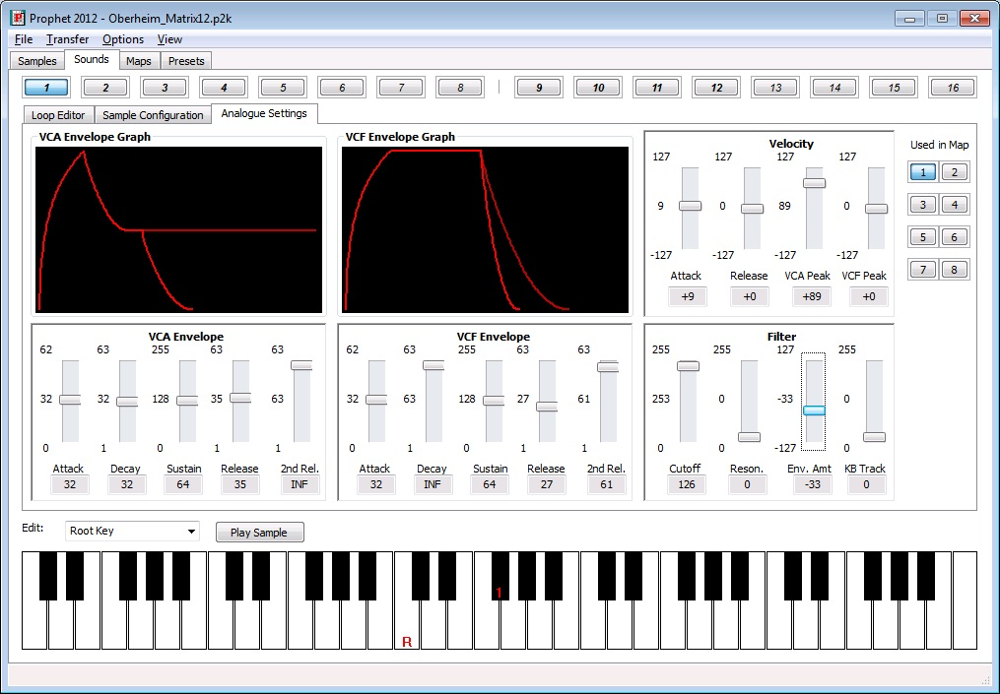

All synthesis relevant parameters related to a sample are accessible on this notebook page. Furthermore the real Prophet values will be displayed below each slider. Some parameters do have a resolution of 255 steps where as the Prophet’s display has only a resolution of 127.

The attack parameters do have a special value called ‘INST.’ for instant on. The decay and release parameters do have a special value ‘INF’ for infinite.

As the Prophet has two settings for the RELEASE phase, these are displayed as two lines. The ‘2nd release’, which is tied to the footswitch, is plotted in a slightly duller color.

The VCF Envelope graph will show the absolute value of the VCA Settings. The volume information defined in the ‘Sample Configuration’ is related to maps and will therefore influence the display of the VCA envelope in the map settings ONLY.

Mapping of the Sound can be edited here as well, please see section 5.2.1.

The quick-access feature will switch over to the map number displayed.

Clicking on the VCF Envelope Graph will display the effect of the ‘Filter Envelope Amount’ setting on the cutoff frequency.

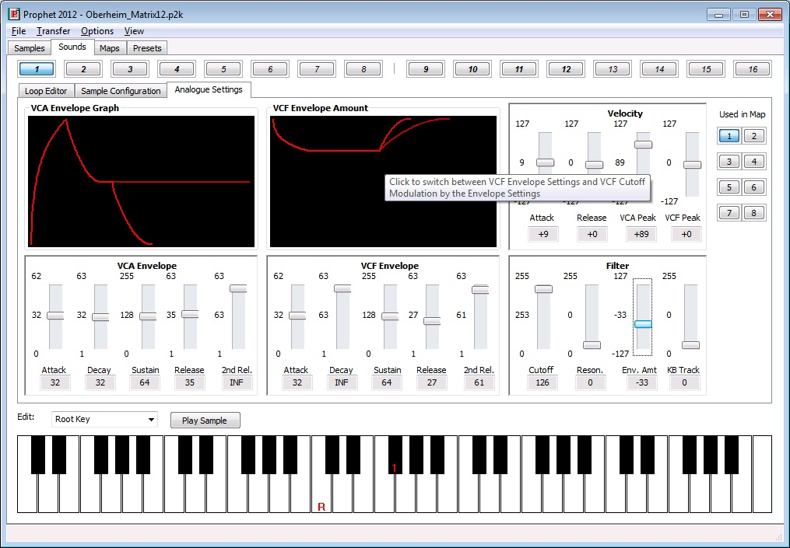

The ‘Zero’-Current line will be moved from the lower border of the ‘VCA Envelope Amount’ to the upper border in case of a negative ‘Filter Envelope Amount’ setting.

### 5.4 Play sound
Pressing the ‘Play’ button will play the current sample in consideration of its start and end point. The parameter ‘wave part’ on the ‘Loop edit’ sub tab will influence the behavior of this play button. If ‘wave part’ is set to ‘whole sample’, the sample between the start and end point will be played once. If set to ‘sustain loop’ or ‘release loop’ the loop part of the current sound will be played as long as the play button will be pressed again.

### 5.5 Context Menu
On each oft he notebook pages related to a sound, a right click on the mouse will invoke the context menu to manage the sound data.

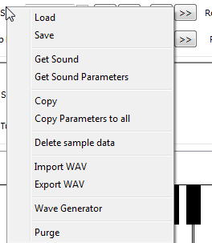

#### 5.5.1 Load
This selection will load a sound with all its parameters, mapping, sample data and loop settings from disk.

#### 5.5.2 Save
This selection will save a sound with all its parameters, mapping, sample data and loop settings to disk.

#### 5.5.3 Get Sound
This selection will just transfer the current sound from the Prophet to the PC. All the sound’s parameters, mapping, sample data and loop settings will be transferred.

#### 5.5.4 Get Sound Parameter
This selection works similar to ‘Get Sound’, but will not get the sample from the Prophet.

#### 5.5.5 Copy
This button will open a dialog, where the destination sound slot can be selected.

There is the option just to copy only all parameters without the sample data or everything to a different sound slot.

#### 5.5.6 Copy Parameters to all
This option will copy all sound parameters to all other sounds.

#### 5.5.7 Delete sample data
This button will delete the current sound sample data. Used memory will be freed up.

#### 5.5.8 Import WAV
Imports a WAV file as sample data.

#### 5.5.9 Export WAV
Saves the current sample in .WAV format to disk

#### 5.5.10 Wave Generator
Will invoke the waveform generator (see 4.2.6).

#### 5.5.11 Purge
‘Purge’ will discard all sample data before the start point and after the end point to free up unused memory.

With enabled stereo mode this will be done for the other channel sound as well.

## 6 Maps
Each map has its own notebook page:

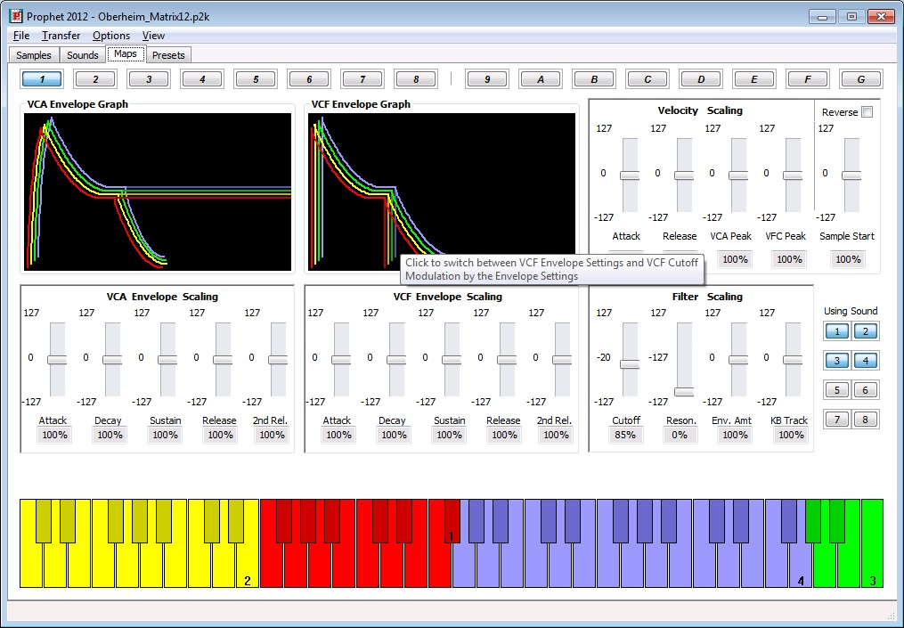

All samples which are assigned to the selected map will be displayed on the keyboard. The sample positions can be changed by setting the high key of a sample on the ‘Sound tab’.

The same color scheme is used for the 3D representation of the graphical envelope display.

As the Prophet architecture does only alter the analogue setting of a Sound (see 5.3), a percentage of the analogue sound settings is displayed below each slider to show the influence of the slider setting in relation to the absolute values define in the analogue sound settings. Volume information defined in the ‘Sample Configuration’ will be reflected by the upper limit of the graphical display of the envelope of the sample.

There are two parameters in the ‘Velocity Scaling’ section that affect the sample data of a map:

- Reverse: This will reverse the sample playback direction defined in the ‘Loop Editor’.

- Sample Start: This will manipulate the sample playback start point based on velocity information.

Each sample will start at the next key of the high key of the previous sample.

Clicking on the ‘VCF Envelope Graph’ will switch over to the ‘VCF Envelope Amount’ display in the same manner as discussed in 5.3.

Clicking on a key on the onscreen keyboard will display all scaled values of the sound being selected.

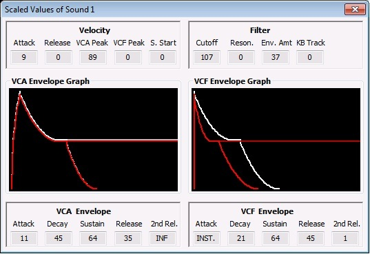

This dialogue will show the values of defined in the ‘Analogue Settings’ for the sound as a white line and the envelope which results out of manipulation of these settings in this map. Here, the total resulting value is displayed below the envelope sections ADSRR.

Clicking on the ‘VCF Envelope Graph’ will switch over to the ‘VCF Envelope Amount’ display in the same manner as discussed in 5.3.

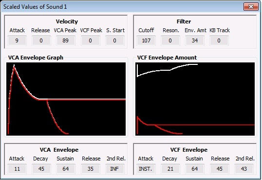

### 6.1 Context menu
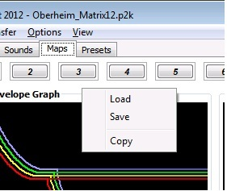

#### 6.1.1 Load
‘Load’ will load the map parameters to the current selected map slot. The sound mapping parameters will not be loaded. These parameters belong to the individual sounds.

#### 6.1.2 Save
‘Save’ will save the map parameters to a file. The sound mapping parameters will not be saved due to the fact that they are part of the individual sounds.

#### 6.1.3 Copy
‘Copy’ will open a dialog where the destination map can be selected. All map parameters will be copied to the destination map slot. Keep in mind that the sound mapping parameters will not be copied. These are part of the individual sounds.

## 7 Preset tab
Presets – the 12 buttons on the Prophet selecting the mapped sounds in a specific configuration.

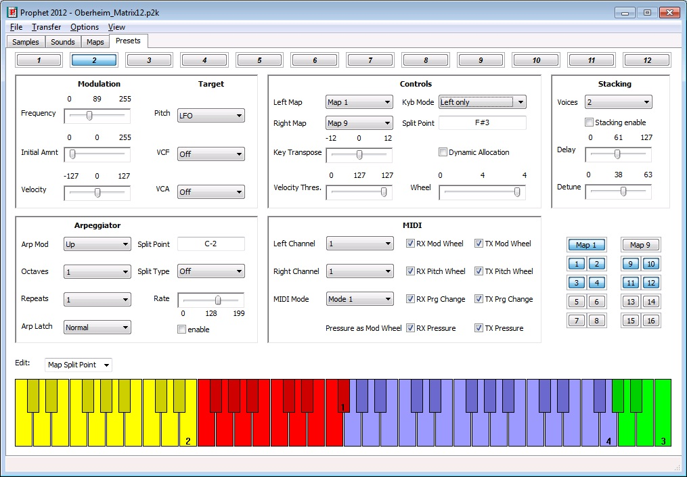

If a keyboard mode with layering is selected the left map samples are displayed on the lower half of a key. The upper half of a key is displaying the right map assigned sample.s

The quick-access feature will give you direct access to a map used in the preset and the sounds combined in the map.

To set the split point for split mode or the arp split point, you have to select the keyboard edit mode:

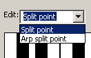

By clicking with the left mouse button you are setting the split point. The key of the split point will be displayed within the corresponding value field inside the parameter view above the keyboard.

### 7.1 Context menu
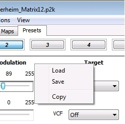

#### 7.1.1 Load
Will load a preset from file to the current preset slot.

#### 7.1.2 Save
Will save the current preset to a file.

#### 7.1.3 Copy
Will open a dialog to select the destination preset. All preset parameters will be copied to the destination preset.

## 8 MIDI Keyboard
The onscreen MIDI keyboard could be displayed by selected ‘MIDI Keyboard’ in the ‘View’ menu:

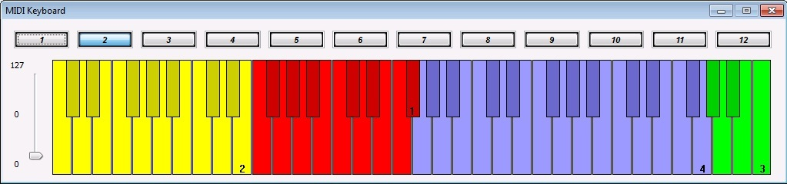

Clicking on the keyboard will send a MIDI note to the Prophet. The highest velocity will be sent if the key is clicked on the bottom. The lowest velocity will be sent if the key is clicked on the top.

Selecting a different preset will be done by just selecting one of the 12 available preset slots above the keyboard.

On the left hand side is the modulation wheel slider.

If there is no sound played by the Prophet please ensure the MIDI settings on the ‘Preset’ tab are matching the MIDI channel on the ‘Misc’ tab.

This onscreen keyboard might be very useful for all Prophet 2002 owners ☺

## 9 Known issues
I had some problems with the MIDI communication with the Prophet. Sometimes some SysEx data packets are corrupted. Some of them could be restored by my software. I have got some disks which could not be transferred to the PC due to communication problems at all. I could never figure out why the communication is not working while having one of these disks loaded into the Prophet.

If you find any bugs please let me know.

Please provide some details about the Prophet you are using (2000/2002, if expanded, which ROM does it have if known, kind of MIDI interface you are using and your operation system version). I am very interested which equipment you are using with this software and if you have experienced some trouble with it.

## 10 Contact
Email: <marius.goebel@curlsystems.de>
